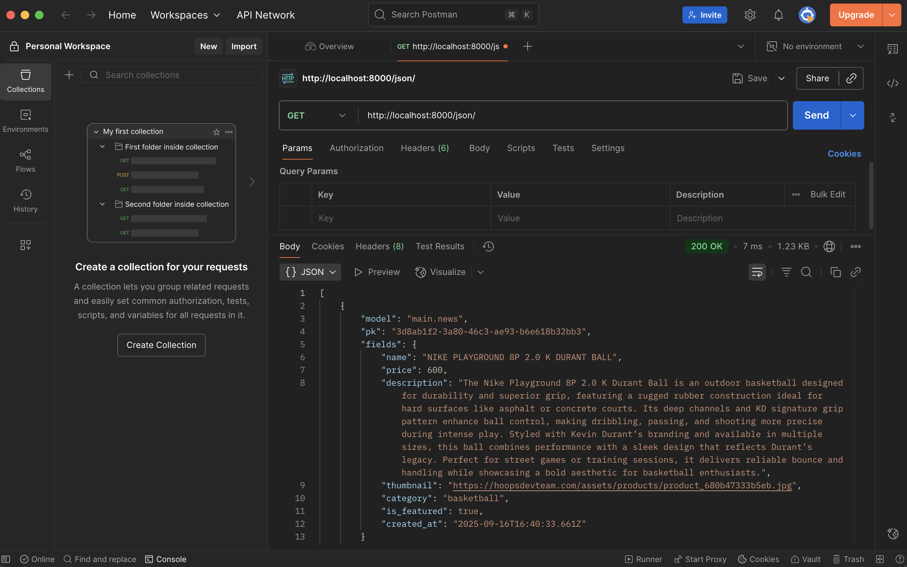
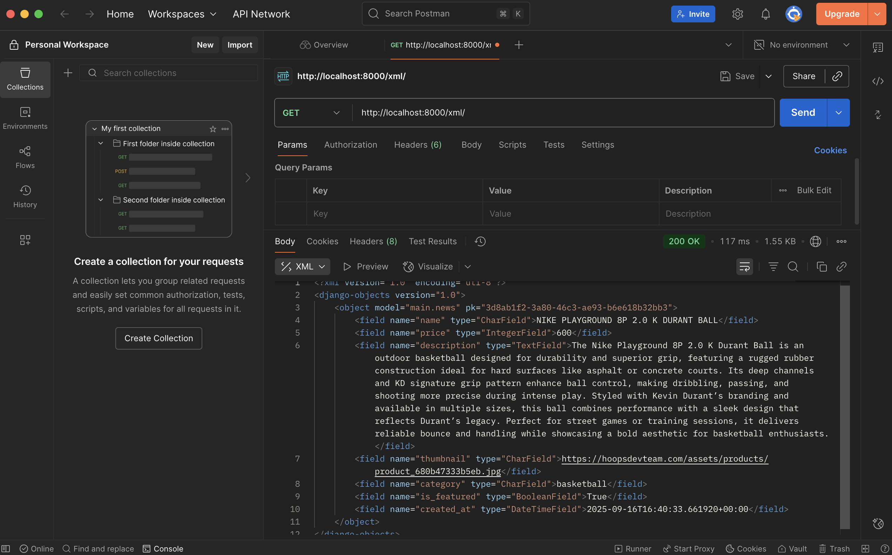
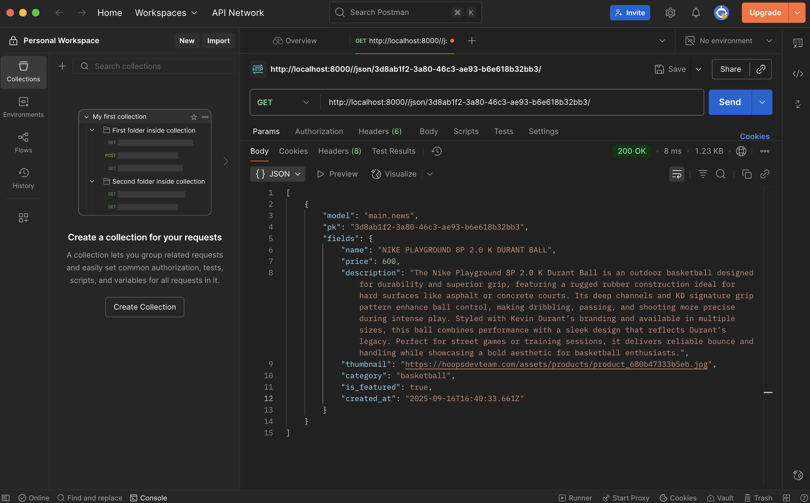
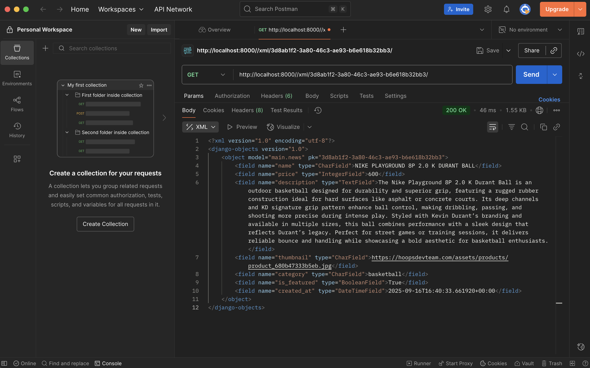

1. We need data delivery because each platform need a communication between clients and servers. Without data delivery, the system can not give information such as user input, product data, or authentication results.
2. JSON, because it is more modern, easier to read and easier to understand. JSON is more popular than XML because JSON is JSON is simpler and more flexible. It supports numbers, objects, strings, and Boolean arrays.
3. we need is_valid() to checks whether the form data is correct and safe before saving. It prevents errors and invalid inputs from being processed.
4. We need a csrf_token to protect forms from CSRF attacks. A CSRF token ensures that the request comes from the user and not from the external source.
5. I created a new Django project and application. Then, i defined the models in models.py according to the required fields. After defined the models, i migrated the database and checked if the models were applied correctly. I created views and connected them to templates for displaying the thing that i want to display. I implemented forms for adding new items and tested their validation using is_valid(). And then i protected all forms with csrf_token to avoid CSRF attacks. I implemented serialization in both JSON and XML to allow data delivery. Finally, I deployed the application and tested it using Postman and a browser.
6. I still don't have any complaints to the TA's because they work properly and help me a lot when i'm doing the tutorial, and if there's an error they will definitely help me fix it while explain why there's an error and how to fix the error.

