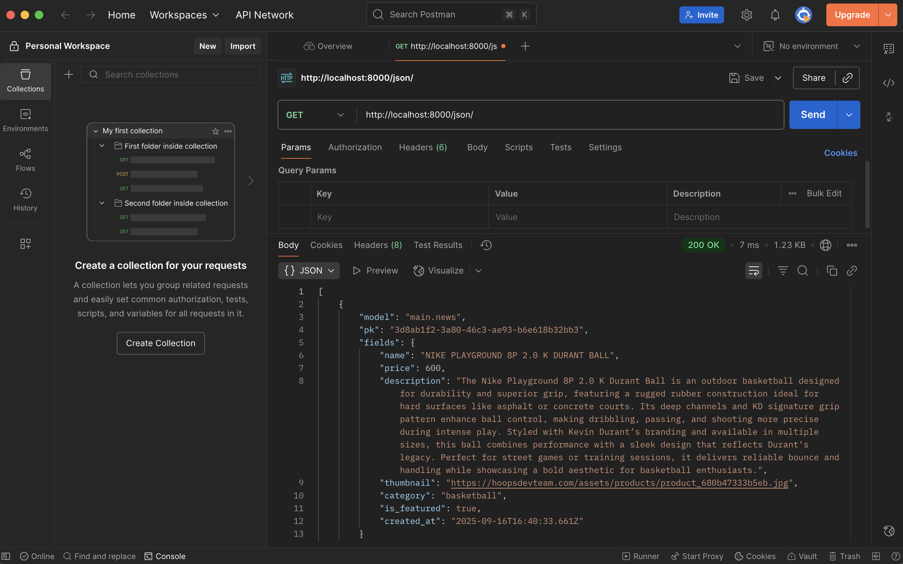
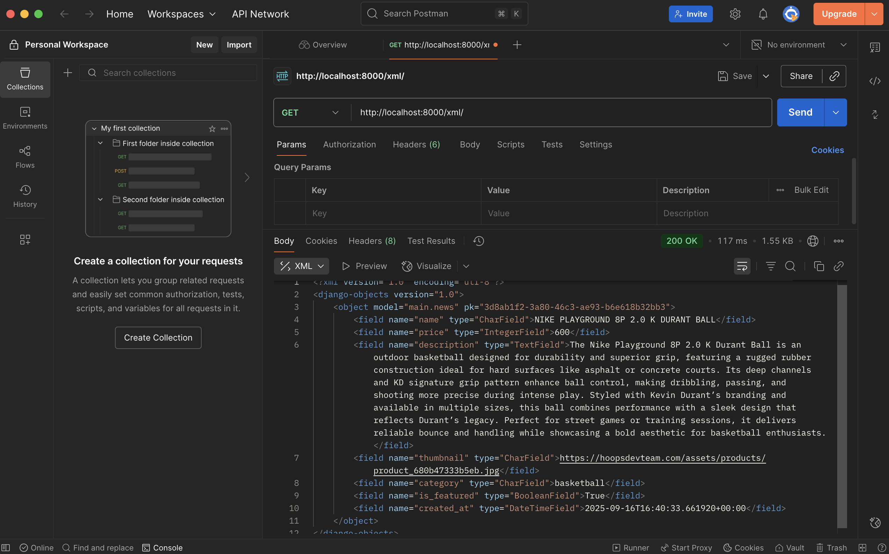
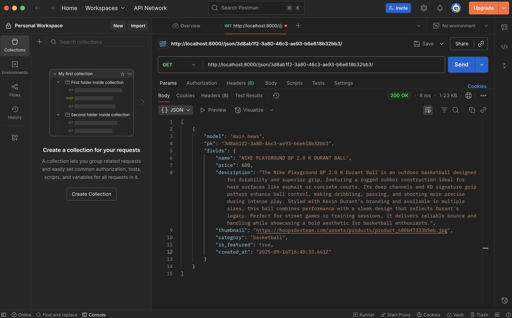
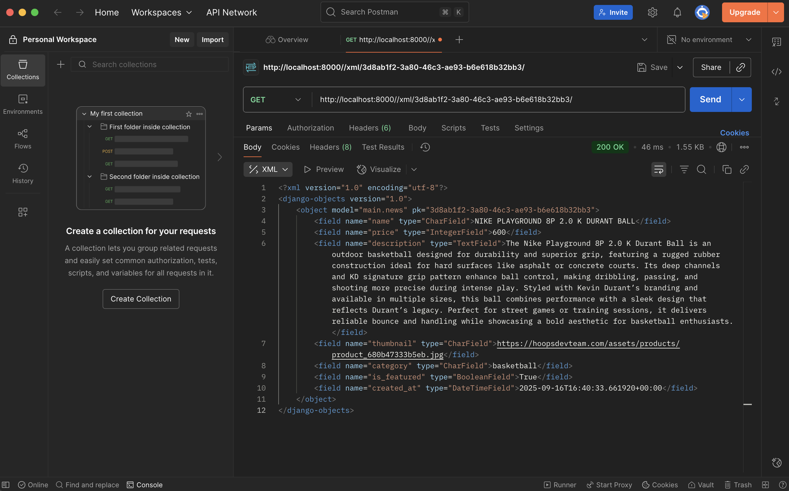

Assignment 2
1. I start by making virtual environment and install Django, then create project and app, add the app into settings.py. After that i write models in models.py, run makemigrations and migrate, then make views and connect them with urls.py. I also create templates folder for HTML and use context to show data. After testing with runserver, i prepare requirements.txt, change settings.py for production (like secret key, debug false, allowed hosts), then push code to PWS.

2. When client send request, Django check urls.py to match the path, then it call function in views.py. The view use models.py to get data from database, then send the data inside context to template HTML. Template render the page and Django return it as response back to browser. So basically urls.py is route, views.py is logic, models.py is data, and HTML is what user see.

3. The file settings.py is to store all configuration. There are installed apps, middleware, and other important thing. Without correct settings.py, the project cannot run properly both in local and in production.

4. Migration in Django mean change models into real database table. First we do makemigrations, Django create migration file that describe change. Then migrate will apply that change to database. Django also save which migration already applied, so we can rollback or forward.

5. Django good for learning because it already have many built-in things like ORM, auth, template, admin, and migration. So beginner can focus on understand web concept, not build everything from zero.

6. I have no complain to the TA's because they always helps me if i have a problem or when i have a question about the tutorial.

Assignment 3
1. We need data delivery because each platform need a communication between clients and servers. Without data delivery, the system can not give information such as user input, product data, or authentication results.
2. JSON, because it is more modern, easier to read and easier to understand. JSON is more popular than XML because JSON is JSON is simpler and more flexible. It supports numbers, objects, strings, and Boolean arrays.
3. we need is_valid() to checks whether the form data is correct and safe before saving. It prevents errors and invalid inputs from being processed.
4. We need a csrf_token to protect forms from CSRF attacks. A CSRF token ensures that the request comes from the user and not from the external source.
5. I created a new Django project and application. Then, i defined the models in models.py according to the required fields. After defined the models, i migrated the database and checked if the models were applied correctly. I created views and connected them to templates for displaying the thing that i want to display. I implemented forms for adding new items and tested their validation using is_valid(). And then i protected all forms with csrf_token to avoid CSRF attacks. I implemented serialization in both JSON and XML to allow data delivery. Finally, I deployed the application and tested it using Postman and a browser.
6. I still don't have any complaints to the TA's because they work properly and help me a lot when i'm doing the tutorial, and if there's an error they will definitely help me fix it while explain why there's an error and how to fix the error.

Assignment 4
1. AuthenticationForm in Django is a ready form for user login. It will check if username and password are correct in database. The advantage is easy to use, efficient because we don't have to make our own login session. The disadvantage is not very flexible to make a custom login session, because it's a built-in.

2. Authentication mean check who is the person by their username and password. Authorization mean check what feature that the user could access, for example there will be some extra features for developer and less feature for user. Django handle authentication with auth system for login, and handle authorization with permission, group, and snippet for example `@login_required`.

3. Session save data in server so the data will be more safe but use more resource. While cookies save data in browser so it will be more light and easy but cookies are more dangerous and risky because user can easily change it.

4. Cookies are not safe by default, hacker can attack and/or steal the data if there is no protection. For example using Cross-site Scripting, MITM, and CSRF. Django help by using HttpOnly, Secure flag, and also CSRF token to stop those kinds of attack.

5. I make register feature using UserCreationForm so user can create account, then i add login with AuthenticationForm, authenticate(), and login() so Django save session when user success login. For logout i use logout(request) to remove session and go back to login page. i protect some page with @login_required so only login user can see it. I also add cookie last_login to save last time user login, set it when login success and delete it when logout. Then i connect "class News" model with User using ForeignKey so every products belong to the creator, and i add filter to show all products or only my products, so that i could see every products i've made with another account or dummy account. Lastly, i put the author's name in the article's description so that other user can see who made the article.

Assignment 5
1. Inline style is strongest, then id, then class (like Tailwind utility), and last is element tag. If two class clash, the last one loaded or written will be implemented.
2. Responsive design is important because user open website in many devices like phone, tablet, or laptop, so layout must look good in all screen size. Example good responsive site is YouTube, it adjust video and menu depends on the screen size, the fact is that there are a lot of people use YouTube nowadays, whhich means that a good responsive design will make user feel comfortable and decide to stay on the website for a long time. Bad example is from deque University, they made a website of an example of a bad responsive design, it looks so bad and messy, and i can guarantee that if there is a website that look like that, it will make user feel deezy and disgust and they won't open that website ever again.
3. Margin means the distance between the element from the screen (m-4). Border is to make an outlined box of the element, so that the element is "squared" (border-yellow-200). Padding is space inside border around the element (p-6).
4. Flexbox is one dimension, mean we control items in row or in column, like navbar or align button center. Grid is two dimension, so we can control rows and columns same time, like making full page layout or photo gallery. Flexbox good for simple align, Grid good for complex structure.
5. I setup the Tailwind and viewport so that it will auto adjust depends on the device (laptop, smartphone, etc). Then, I made a navbar.html inside templates/, and add new folders named static and images, and i add global.css inside static and no-products.png photo inside images folder. I also add a new function which is a Delete Button. And then i design my website and i chose purple and yellow/gold color so that it looks premium and sporty. In broad terms, i just edit all the .html file in main/templates/.